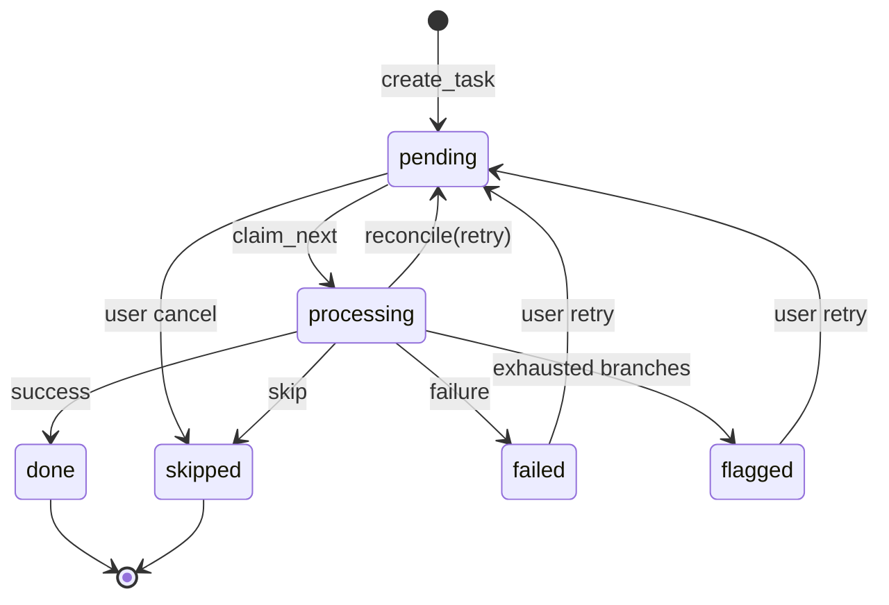

# Ledger

SQLite-backed ledger for exactly-once task processing, branch-attempt audit, flags, and
position-keyed name reservations.

## State machine



`processing → pending` is allowed only via crash `reconcile(policy="retry")`, not ordinary
user transitions.

## Tables

| Table | Purpose |
|---|---|
| `pipelines` | Named pipeline; points at current `playbook_versions` row |
| `playbook_versions` | Immutable YAML snapshots (`public_id` = `pv_{id:04d}`) |
| `tasks` | Work units with status, dedup key, ordinal, attempts |
| `branch_attempts` | Per-branch execution history for escalation |
| `name_reservations` | Ordinal → export name bindings (reserved on failure) |
| `flags` | Human-visible issues with escalation level |

## Invariants

1. **Exactly-once:** `(pipeline_id, dedup_key)` is unique; duplicate `create_task` returns
   `None` forever, even after the first task is `done`.
2. **Single claim:** `claim_next` uses `BEGIN IMMEDIATE` so only one worker claims a pending
   task.
3. **Legal transitions:** `VALID_TRANSITIONS` is enforced; illegal moves raise
   `IllegalTransitionError`.
4. **Name reservations:** `reserve_name` is idempotent per `(pipeline_id, ordinal)`; the first
   name wins.
5. **WAL durability:** committed state survives reopening the database file.

## Concurrency posture

`claim_next` uses `BEGIN IMMEDIATE`, so cross-process double-claims are impossible. Other transitions use
plain sessions; until a later hardening pass (Step 15), the supported mode is **one writer process per
pipeline at a time** — for example, do not run `ordine run --oneshot` against a pipeline that
`ordine serve` is actively serving. WAL mode and dedup unique constraints keep exactly-once intact
regardless; the only risk without single-writer discipline is benign status-update races between
concurrent writers.

## Flag escalation

```
flag level = exhausted branch groups
```

A branch group (primary = `None`, or a named recovery branch) is *exhausted* when it has at
least one recorded attempt and no attempt with `ok=True`. When the primary path is exhausted,
level is 1; each subsequently exhausted named branch adds 1. A later successful attempt on a
branch removes that branch from the exhausted count.

## Schema migrations

Schema version is stored in SQLite `PRAGMA user_version` (currently **1**). `init_db` creates
tables on first run and rejects unknown versions. Alembic migrations are deferred; bump
`SCHEMA_VERSION` and document the change when the schema evolves.

## API surface

All database access goes through `ordine.core.ledger.Ledger`. ORM rows are never exposed;
callers receive frozen dataclass views (`TaskView`, `VersionInfo`, `FlagView`).

Notable methods added for later steps:

- `next_arrival_ordinal()` — arrival-order triggers (Step 6)
- `set_current_version()` / `get_version_yaml()` — editor history (Step 10)
- `register_pipeline(..., parent_public_id=, make_current=)` — version branching
